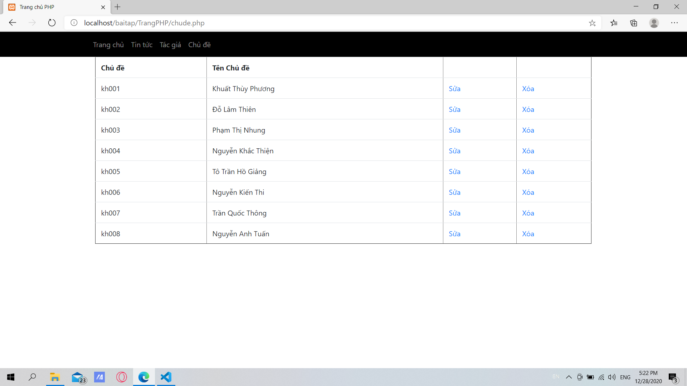
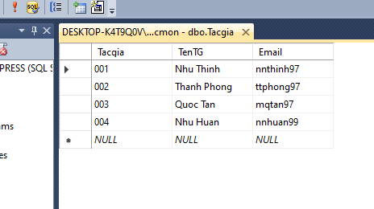
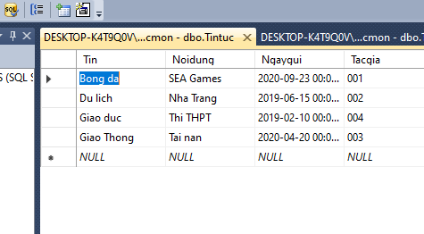
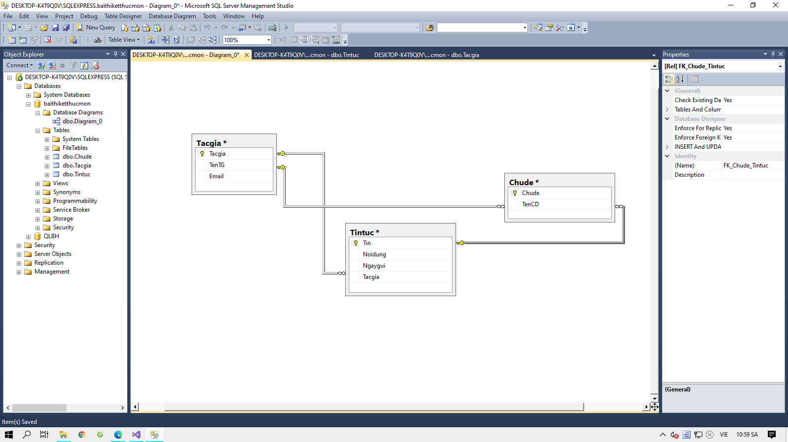

# Họ và tên: Nguyễn Như Thịnh
# Lớp: CTT12CĐ3A
# Bài thi môn: Xây dựng Website thương mại
# Ngày thi: 28/12/2020
# Nội dung:
- Trang tin tức:
- Trang chủ đề:
- Trang tác giả:
- Các bảng cơ sở dữ liệu:
- Mối quan hệ giữa các bảng:
Bảng chủ đề:

Bảng tác giả:

Bảng tin tức:

Bảng mối quan hệ:

