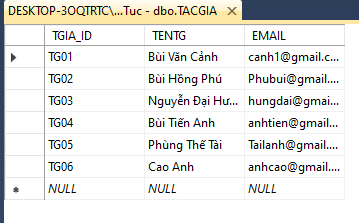
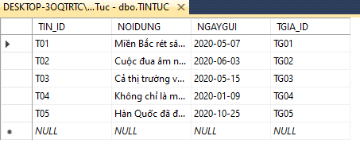

# Họ và tên: Nguyễn Như Thịnh
# Lớp: CTT12CĐ3A
# Bài thi môn: Xây dựng Website thương mại
# Ngày thi: 28/12/2020
# Nội dung:
- Trang tin tức:

- Trang chủ đề:

- Trang tác giả:

- Trang mục chỉnh sửa:

- Các bảng cơ sở dữ liệu:
<h2>Bảng chủ đề:</h2>

<h2>Bảng tác giả:</h2>

<h2>Bảng tin tức:</h2>

- Mối quan hệ giữa các bảng:

